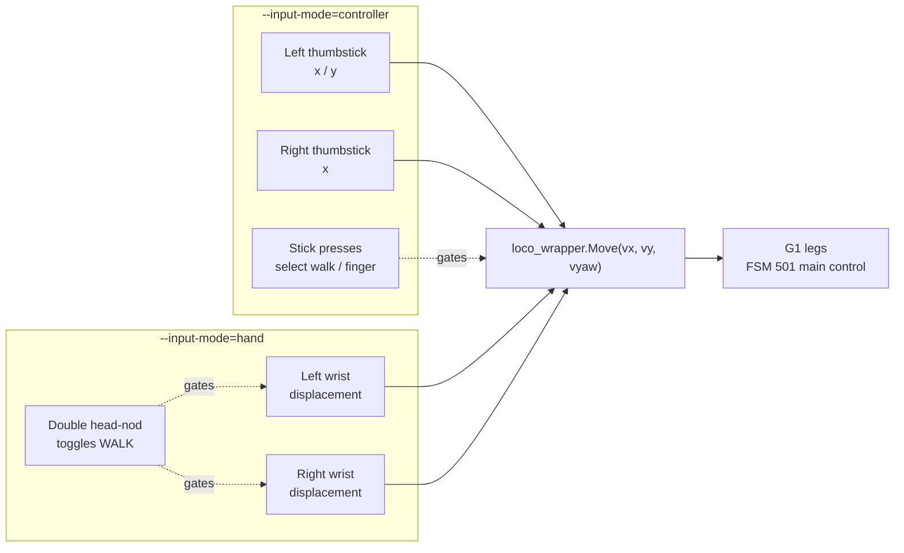
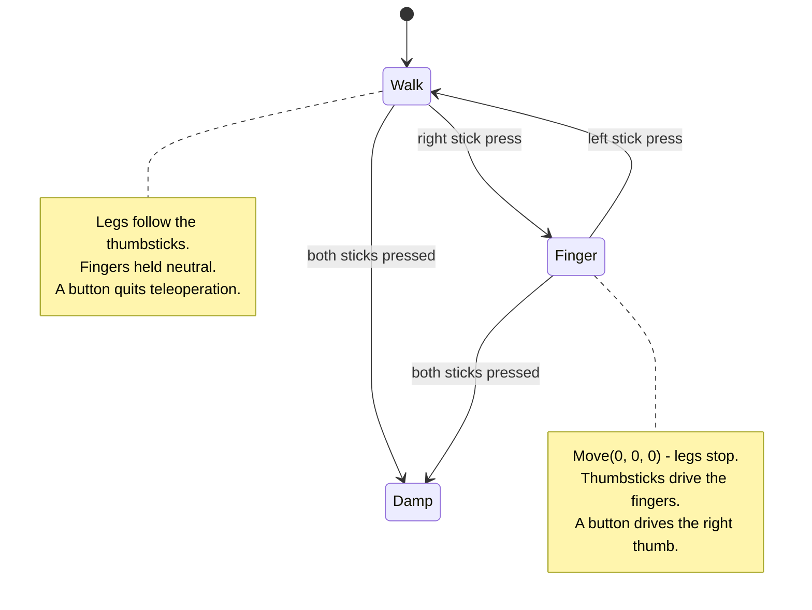
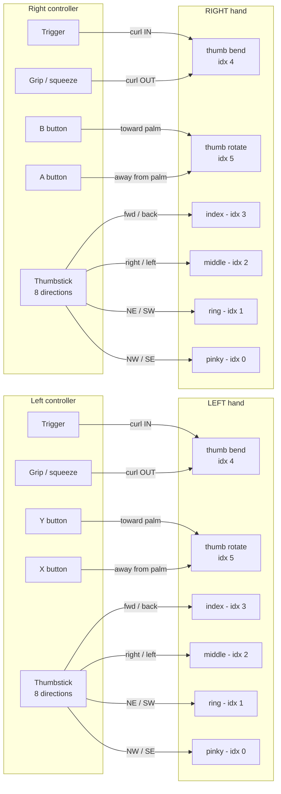
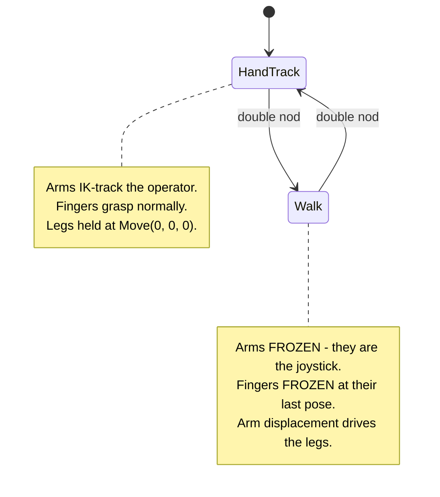
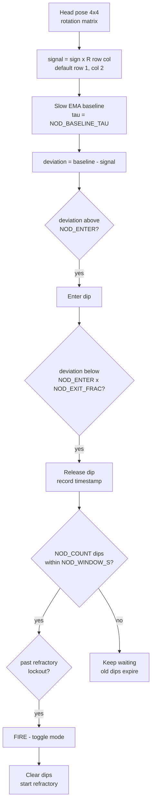
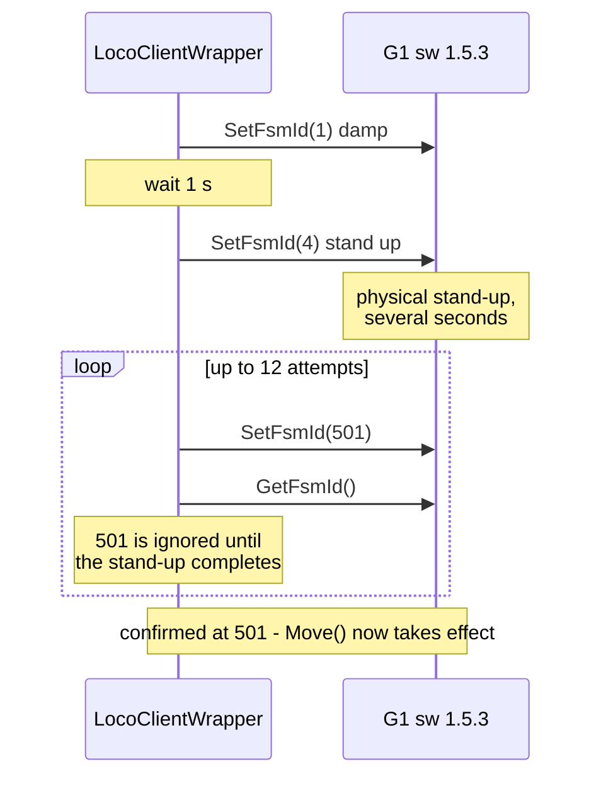

# 🚶 Locomotion: walking in both controller and hand mode

On a G1 running `--motion`, **locomotion is available from either input mode**. Both paths end
at the same call — `loco_wrapper.Move(vx, vy, vyaw)` — and both use the **same axis mapping**.
The only difference is where the three axes come from:

- **`--input-mode=controller`** — the thumbsticks, as before.
- **`--input-mode=hand`** — there are no thumbsticks, so the operator **double-nods** to flip
  into WALK mode and then steers by **displacing their arms**, which become the joystick.



## 🎯 Shared axis mapping

The hand-mode mapping was chosen to mirror the thumbsticks exactly, so muscle memory carries
across modes:

| Axis   | Meaning         | Controller mode              | Hand mode (WALK)                   |
| :----- | :-------------- | :--------------------------- | :--------------------------------- |
| `vx`   | forward / back  | left stick, vertical         | **left** arm forward / back        |
| `vy`   | strafe          | left stick, horizontal       | **left** arm left / right          |
| `vyaw` | turn            | right stick, horizontal      | **right** arm left / right         |

Controller values are scaled by `0.3`; hand values run through a deadzone and gain, then clamp
at `WALK_VMAX` (also `0.3` by default). Wrist poses are already in the arm-IK target frame
(robot basis: x = forward, y = left, z = up), so displacement maps straight onto the axes.

---

# 🕹️ Controller mode

Both modes coexist on the same sticks; a **stick press** selects which one is live. This is what
makes walking and grasping possible in one session with `--ee=inspire_dfx`.



⚠️ **The A button is overloaded.** It quits teleoperation only in **walk** mode. In finger mode
it drives the right thumb away from the palm, so quitting requires a left-stick press first.

Pressing **both sticks together** is the soft e-stop and calls `Enter_Damp_Mode()`, regardless of
which mode is active.

## 🖐️ Finger mapping in finger mode

Each controller drives **its own hand** — left controller to left hand, right to right. The two
sides are identical apart from the button letters, which differ because the left controller carries
X/Y and the right carries A/B.



### 🧭 The thumbstick rose

The four fingers share one thumbstick, split across its **8 directions** — each axis pairs a
*close* direction with its opposite *open* direction:

```
                        forward
                      INDEX close
                            │
          NW                │                NE
      PINKY close           │           RING close
                ╲           │           ╱
                  ╲         │         ╱
                    ╲       │       ╱
     left ───────────────── ● ───────────────── right
  MIDDLE open               │               MIDDLE close
                    ╱       │       ╲
                  ╱         │         ╲
                ╱           │           ╲
          SW                │                SE
       RING open            │          PINKY open
                            │
                          back
                       INDEX open
```

Only **one finger moves at a time**. Two gates enforce it: the stick must be pushed past
`MAG_THRESH` (0.6) before anything moves, and the direction must fall within `DOT_THRESH` (0.94,
about 20°) of one of the eight vectors. Push the stick between two directions and *nothing*
happens — which is deliberate, but means the four diagonals need a more accurate push than the
cardinals.

### 📋 Full mapping

| Input | Left controller | Right controller | Target | Effect |
| :---- | :-------------- | :--------------- | :----- | :----- |
| Trigger | trigger | trigger | thumb bend (idx 4) | curl **in** (toward closed) |
| Grip | squeeze | squeeze | thumb bend (idx 4) | curl **out** (toward open) |
| Thumb rotate toward palm | **Y** | **B** | thumb rotation (idx 5) | rotate toward palm |
| Thumb rotate away | **X** | **A** | thumb rotation (idx 5) | rotate away from palm |
| Stick forward / back | stick | stick | index (idx 3) | close / open |
| Stick right / left | stick | stick | middle (idx 2) | close / open |
| Stick NE / SW | stick | stick | ring (idx 1) | close / open |
| Stick NW / SE | stick | stick | pinky (idx 0) | close / open |

Targets are held in DDS `q` space where **0 = closed and 1 = open**, start fully open, and are
rate-integrated rather than absolute: holding an input moves the finger at `STEP` per frame, so at
100 fps a finger travels its full range in about **1 second**. Release and it simply stops where
it is — there is no spring-back.

> ⚠️ Unlike the nod and walk parameters, these are **class constants in
> `Inspire_Controller_Ctrl`, not environment variables** — changing them needs a code edit.
>
> | Constant | Default | Effect |
> | :------- | :------ | :----- |
> | `STEP` | `0.01` | Per-frame travel. Full range in ~1 s at 100 fps. |
> | `MAG_THRESH` | `0.6` | How far the stick must be pushed before a finger moves. |
> | `DOT_THRESH` | `0.94` | Angular tolerance, ~20°. Lower it if diagonals feel fussy. |
> | `TOWARD_SIGN` | `-1.0` | Flip if thumb rotation goes the wrong way. |

---

# 🙆 Hand mode: nodding to switch states

With no thumbsticks available, hand mode needs a gesture that is **unambiguous** and does not
collide with ordinary manipulation. A *double downward head-nod* was chosen because a vertical
head motion is easy to perform deliberately and hard to perform by accident while looking around.



On entering WALK the controller captures the current wrist positions as the **joystick centre**,
so steering is measured relative to wherever your arms happened to be — there is no need to
return to a fixed neutral pose first.

Two freezes happen on entry, and both matter:

- **Arms freeze** at the last tracked IK solution (`frozen_sol_q`). Without this the robot's arms
  would flail as you waved yours around to steer.
- **Fingers freeze** at their last pose — the finger position arrays simply stop being updated.
  Without this, the steering motion would be retargeted into an unintended grasp.

## 🔍 How the nod is detected

The detector never looks at absolute head angle — only at *transient deviation from where your
head has recently been resting*. That way it works regardless of how you naturally hold your head.



Step by step:

1. **Signal.** One entry of the head rotation matrix — by default `R[1, 2]`, the vertical
   component of the head's fore-aft axis under OpenXR's Y-up convention. Nodding tilts that axis
   and moves the number; a left/right head *shake* is a yaw rotation and barely moves a vertical
   matrix entry, which is why looking around does not trigger it.
2. **Baseline.** A slow exponential moving average (default τ = 1.0 s) tracks your resting head
   pose, so a quick nod appears as a short-lived deviation rather than a permanent offset.
3. **Dip with hysteresis.** A dip *starts* when `deviation` exceeds `NOD_ENTER` (0.12) and only
   *completes* when it falls back below `NOD_ENTER × NOD_EXIT_FRAC` (0.06). The two different
   thresholds stop a signal hovering near the edge from rattling off dozens of dips.
4. **Counting.** The dip is recorded **on release**, not on entry. Dips older than
   `NOD_WINDOW_S` (3.0 s) are discarded, so the two nods must land inside a rolling window.
5. **Refractory lockout.** After firing, further toggles are suppressed for `NOD_REFRACTORY_S`
   (1.0 s) and the dip list is cleared, so one gesture cannot fire twice.

### ⏱️ What fires and what doesn't

```
signal
  │   ┌──┐    ┌──┐                    ┌──┐                 ┌──┐    ┌──┐
  │   │  │    │  │                    │  │                 │  │    │  │
──┴───┘  └────┘  └────────────────────┘  └─────────────────┘  └────┘  └──────
      nod 1    nod 2                  single nod           nod 1    nod 2
      └──── within 3.0 s ────┘                             └── within 3.0 s ──┘
              ✅ FIRE                     ❌ expires                ✅ FIRE
```

A lone nod never toggles anything — it simply ages out of the window. This is the behaviour
covered by the module's self-test, which feeds a synthetic signal through the detector and
asserts exactly two toggles:

```bash
python -m teleop.utils.hand_walk     # no robot, no XR headset required
```

### 🎚️ Tuning the nod

Every parameter is an environment variable, so the gesture can be calibrated on the gantry
without editing code. Run with `NOD_DEBUG=1` to print the live signal, baseline, deviation and
dip count each frame:

| Variable            | Default | Effect                                                        |
| :------------------ | :------ | :------------------------------------------------------------ |
| `NOD_COUNT`         | `2`     | Dips required to fire. `3` if double-nods trigger accidentally. |
| `NOD_WINDOW_S`      | `3.0`   | Rolling window the dips must land inside.                      |
| `NOD_ENTER`         | `0.12`  | Deviation to start a dip. Raise if it over-triggers.           |
| `NOD_EXIT_FRAC`     | `0.5`   | Release threshold as a fraction of `NOD_ENTER`.                |
| `NOD_BASELINE_TAU`  | `1.0`   | Baseline time constant, seconds.                               |
| `NOD_REFRACTORY_S`  | `1.0`   | Lockout after a fire.                                          |
| `NOD_SIGN`          | `1.0`   | Flip if nodding **down** registers as up.                      |
| `NOD_ROW` / `NOD_COL` | `1` / `2` | Which rotation-matrix cell to use, if your headset frame differs. |

> 💡 `NOD_WINDOW_S` was widened from 1.5 s to 3.0 s after on-robot testing — 1.5 s demanded an
> uncomfortably brisk double-nod.

### 🎚️ Tuning the steering

| Variable             | Default | Effect                                        |
| :------------------- | :------ | :-------------------------------------------- |
| `WALK_VMAX`          | `0.3`   | Velocity clamp on all three axes.             |
| `WALK_DEADZONE_M`    | `0.05`  | Displacement ignored around the centre, metres. |
| `WALK_GAIN_FWD`      | `1.5`   | Metres of displacement → `vx`.                 |
| `WALK_GAIN_STRAFE`   | `1.5`   | Metres of displacement → `vy`.                 |
| `WALK_GAIN_TURN`     | `2.0`   | Metres of displacement → `vyaw`.               |
| `WALK_SIGN_*`        | `1.0`   | Flip an axis that steers backwards.            |

`WALK_DEBUG=1` prints the live displacements and resulting velocities.

---

# 🛡️ Safety behaviour

| Condition                        | Response                                                          |
| :------------------------------- | :---------------------------------------------------------------- |
| XR tracking lost in hand mode    | `Move(0, 0, 0)` every frame — the robot never keeps walking on stale data. |
| Both sticks pressed (controller) | `Enter_Damp_Mode()` soft e-stop.                                   |
| DDS link dies                    | `LinkWatchdog` logs an explicit error instead of freezing silently. |
| Entering WALK (hand mode)        | Arms and fingers freeze, so steering cannot become a grasp.         |

⚠️ `LinkWatchdog` tracks **lowstate freshness only**. A motor in a PC-to-motor timeout still
reports through a healthy link and will not be caught here.

---

# ⚙️ Reaching the walkable state

None of the above works until the robot is in its walkable FSM state. On G1 **sw 1.5.3** the
SDK's `Start()` sets FSM 500, which this firmware silently ignores — it returns success while the
robot stays in 802 and refuses to walk. The walkable state is **501**, reached via
damp → stand → main-control:



The retry loop exists because the stand-up is a physical motion of variable duration, and
`SetFsmId(501)` is discarded until it finishes. Override the target with `G1_CTRL_FSM` if a
future firmware moves it.

> 💡 Only `Regular mode` (R1+X) is supported. `Running mode` (R2+A) is not.
