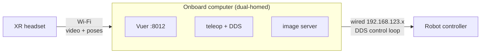

# 📡 Running teleoperation onboard (cable-free operation)

This document covers running `teleop_hand_and_arm.py` **on the robot's own computer** rather than
on a laptop tethered by Ethernet. That is what makes wireless operation possible, and the reason
why is not obvious — it cost us a day to establish, so it is written down first.

---

# 1. ❓ Why you cannot just put the robot on Wi-Fi

The intuitive approach — connect the robot to your Wi-Fi, then run teleop on a laptop with
`--network-interface=<wifi>` — **does not work**, and it fails in a way that looks like a network
misconfiguration.

**The robot's DDS is published only on the internal wired `192.168.123.0/24` network.** Putting the
robot's computer on Wi-Fi gives you the mobile app and SSH, but the DDS participant never announces
there, so discovery finds nothing.

We verified this by listening for SPDP announcements on both interfaces of a computer that sits on
*both* networks at once:

| listening on | SPDP announcements in 10 s |
| :----------- | :------------------------- |
| Wi-Fi interface (`192.168.1.x`) | **none** |
| wired robot interface (`192.168.123.x`) | **64, from the robot controller** |

This is by design — the internal network is a dedicated control link — not something to fix.

> 💡 **`--network-interface` names a *local* NIC, not the robot.** It selects which interface
> CycloneDDS binds. You never tell teleop where the robot is; DDS *discovers* it. The only robot
> address you ever supply is `--img-server-ip`.

**The consequence:** something on the robot's internal network has to run the control loop. The
onboard computer is already there and already dual-homed, so run teleop on it.



Only video and XR poses cross Wi-Fi. The control loop stays on the wired link, where it belongs —
latency there shows up as view lag rather than as an unstable control loop.

---

# 2. 🧱 Platform notes

Verified on a Jetson (JetPack 5.1.1 / L4T R35.3.1, Ubuntu 20.04, glibc 2.31, aarch64, 8 cores).

The system Python is **3.8**, which this project does not support. Install Miniforge and build a
**3.10** environment alongside it; do not disturb the system Python, since the image server and any
ROS workspaces use it.

---

# 3. 📥 Installation

```bash
# 1. Miniforge (conda-forge, aarch64)
curl -L -O https://github.com/conda-forge/miniforge/releases/latest/download/Miniforge3-Linux-aarch64.sh
bash Miniforge3-Linux-aarch64.sh -b -p ~/miniforge3

# 2. Environment. NOTE: pinocchio 3.x does NOT exist for linux-aarch64 -- conda-forge
#    has 2.6.x and 4.1.0 only. 4.1.0 works: every API robot_arm_ik.py uses is unchanged.
~/miniforge3/bin/conda create -y -n tv python=3.10 pinocchio=4.1.0 casadi nlopt 'numpy<2' -c conda-forge

# 3. Repo
git clone --recurse-submodules <your fork> ~/xr_teleoperate

# 4. dex-retargeting pins two packages that cannot be honoured here. Relax them:
#      torch==2.3.0        -> torch    (JetPack CUDA wheels are py38-only; CPU torch is fine,
#                                       teleop imports torch nowhere and nothing requests CUDA)
#      nlopt>=2.6.1,<2.8.0 -> nlopt    (aarch64 conda-forge starts at 2.10)
cd ~/xr_teleoperate/teleop/robot_control/dex-retargeting
cp pyproject.toml pyproject.toml.bak
sed -i 's|"torch==2.3.0",|"torch",|; s|"nlopt>=2.6.1,<2.8.0",|"nlopt",|' pyproject.toml

# 5. Install. --no-deps on dex-retargeting is deliberate: its `pin>=2.7.0` dependency is
#    PyPI pinocchio, which would shadow the working conda build.
TV=~/miniforge3/envs/tv/bin/python
echo "numpy<2" > /tmp/constraints.txt; export PIP_CONSTRAINT=/tmp/constraints.txt
$TV -m pip install -e teleop/televuer
$TV -m pip install -e teleop/teleimager
$TV -m pip install --no-deps -e teleop/robot_control/dex-retargeting
$TV -m pip install pytransform3d trimesh anytree lxml pyyaml torch
$TV -m pip install -r requirements.txt

# 6. vuer 0.0.60 needs params-proto 2.x. See the troubleshooting table -- 3.x fails SILENTLY.
$TV -m pip install 'params-proto==2.13.2'

# 7. unitree_sdk2_python. The cyclonedds bindings compile against an existing CycloneDDS,
#    so CYCLONEDDS_HOME must point at one before installing.
export CYCLONEDDS_HOME=/path/to/cyclonedds/install
$TV -m pip install -e ~/unitree_sdk2_python
```

> ⚠️ **Use a recent `unitree_sdk2_python`.** Older checkouts lack `LocoClient.GetFsmId`, which
> `LocoClientWrapper` needs. The symptom is a burst of `[ClientStub] send request error` followed by
> `AttributeError: 'LocoClient' object has no attribute 'GetFsmId'`. If other software on the robot
> depends on the old checkout, clone a second copy rather than moving it forward.

**TLS certificates.** Copy `cert.pem` / `key.pem` into `~/.config/xr_teleoperate/` on the robot
(`chmod 600` the key). The certificate must carry a SAN for the address the headset will use — the
onboard computer's Wi-Fi address, not the laptop's.

---

# 4. 🚀 Launcher

Four environment variables are load-bearing. Each failure mode is confusing enough that a launcher
script is worth keeping:

```bash
#!/usr/bin/env bash
TV=$HOME/miniforge3/envs/tv

# The repo is not pip-installed; teleop_hand_and_arm.py adds the repo root to sys.path
# itself, but other scripts in teleop/ need this.
export PYTHONPATH=$HOME/xr_teleoperate

# cyclonedds python bindings resolve libddsc.so through these
export CYCLONEDDS_HOME=/path/to/cyclonedds/install
export LD_LIBRARY_PATH=$CYCLONEDDS_HOME/lib:${LD_LIBRARY_PATH:-}

# aarch64 ONLY: torch's libc10.so must load first, or importing dex_retargeting fails with
# "cannot allocate memory in static TLS block"
export LD_PRELOAD=$TV/lib/python3.10/site-packages/torch/lib/libc10.so

cd "$HOME/xr_teleoperate/teleop"
exec "$TV/bin/python" teleop_hand_and_arm.py "$@"
```

Run it with the image server on the same machine:

```bash
./run_teleop.sh --ee=inspire_dfx --motion --network-interface=eth0 \
                --img-server-ip=127.0.0.1 --headless --input-mode=hand
```

`--network-interface` is the **wired** interface (DDS), and `--img-server-ip=127.0.0.1` because the
image server is now local — video never touches the network. The headset connects to
`https://<onboard wifi address>:8012`.

---

# 5. ⚡ Performance

Teleop caps BLAS/OpenMP threading to 1 at import time (`teleop_hand_and_arm.py`, before numpy
loads). This is not a micro-optimisation. The arm IK is a 14-DoF problem, far too small to
parallelise; left at its default OpenBLAS starts one thread per core, and on 8 cores that put 35
threads and ~392% CPU into the main process, starving the video pipeline.

Measured on-robot, **identical IPOPT iteration counts in both cases**:

| | IK mean | IK p95 | control loop |
| :-- | --: | --: | --: |
| default threading | 15.9 ms | 33–44 ms | ~10 Hz |
| **threads = 1** | **4.0 ms** | **5–6 ms** | **29–30 Hz** |

The collapse in *jitter* matters more than the mean — inconsistent delay is what an operator
perceives as lag.

Diagnosing this class of problem: run teleop with `TELEOP_LOG_LEVEL=DEBUG` to get per-frame `ik:`
timings, and sample per-core load during a live run. A single process at several hundred percent
CPU with dozens of threads is the signature.

> ⚠️ **Do not reach for `taskset` first.** Pinning the *whole* teleop process tree to a subset of
> cores makes things **worse** — televuer, the image client and the hand controller get squeezed
> alongside the control loop. We measured IK going from 60 ms to 95 ms doing exactly that. Fix
> threading before considering affinity at all.

---

# 6. 🔧 Troubleshooting

Failures we hit, with the signature that identifies each:

| Symptom | Cause |
| :------ | :---- |
| `cannot import name 'Vuer' from 'vuer'`, and `dir(vuer)` is **empty** | `params-proto` 3.x dropped `Flag`. `vuer/__init__.py` swallows the ImportError in a bare `except` and prints a misleading "install vuer[all]" message. The extras are fine. Diagnose with `import vuer.server` directly. Pin `params-proto==2.13.2`. |
| `libc10.so: cannot allocate memory in static TLS block` | aarch64 TLS exhaustion when torch loads late. `LD_PRELOAD` torch's `libc10.so`. |
| `Failed to build 'cyclonedds'` | `CYCLONEDDS_HOME` not set; the bindings need an existing CycloneDDS to compile against. |
| `AttributeError: 'LocoClient' object has no attribute 'GetFsmId'`, preceded by `[ClientStub] send request error` | `unitree_sdk2_python` too old. Both symptoms are the same cause. |
| `ModuleNotFoundError: No module named 'teleop'` | Running a script from outside `teleop/`. `sys.path[0]` is the *script's* directory. Set `PYTHONPATH` to the repo root. |
| `does not contain a valid URDF model` | Asset paths are relative to `teleop/`. Run from there. |
| `Waiting to subscribe dds` / RPC code 3102 | DDS is not reaching the robot. Confirm the interface actually carries it by listening for SPDP on `239.255.0.1:7400` — see section 1. |
| Robot answers ping but no DDS | Almost always the wrong interface, or an interface with no route to the robot's internal network. |

> 💡 **A useful habit:** listen for SPDP announcements from a host on the robot's own network before
> concluding the robot is at fault. A quiet listen on the wrong interface looks identical to a dead
> robot, and that mistake is expensive.
