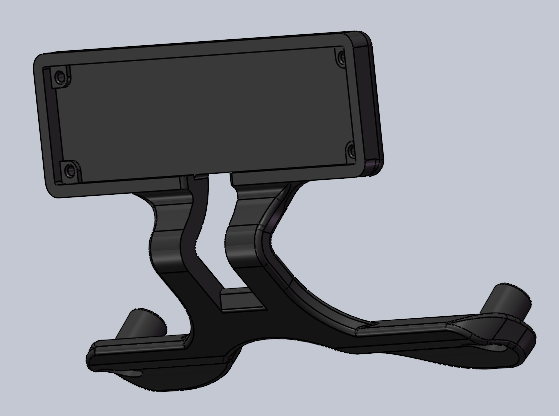
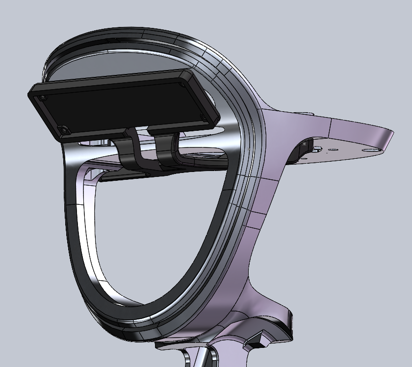
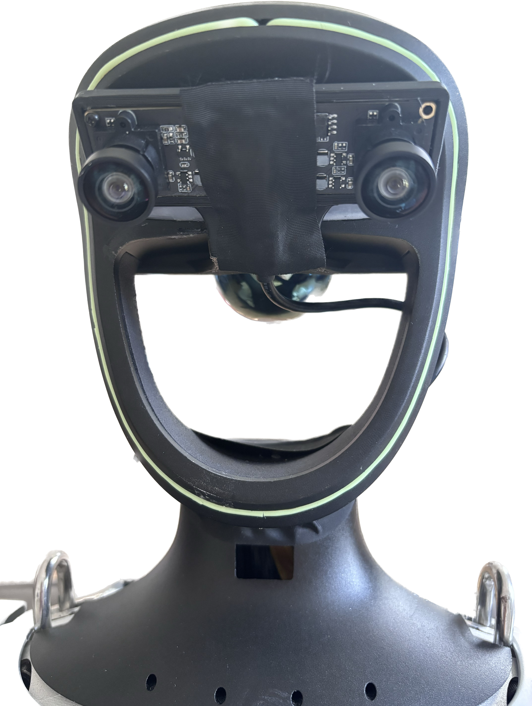
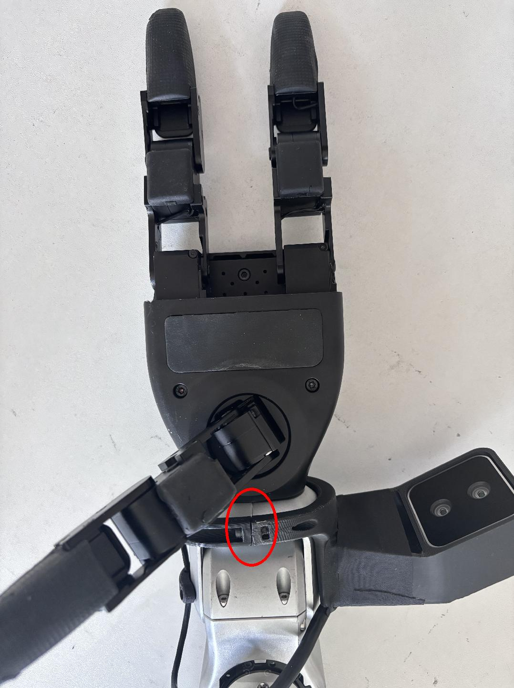
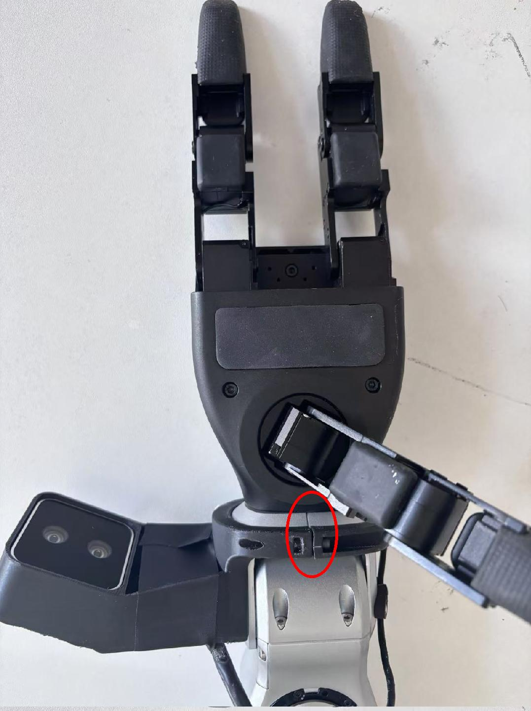

<div align="center">
  <h1 align="center"> avp_teleoperate </h1>
  <h3 align="center"> Unitree Robotics </h3>
  <p align="center">
    <a> English </a> | <a href="README_zh-CN.md">中文</a> | <a href="README_ja-JP.md">日本語</a>
  </p>
</div>

# 📺 Video Demo

<p align="center">
  <table>
    <tr>
      <td align="center" width="50%">
        <a href="https://www.youtube.com/watch?v=OTWHXTu09wE" target="_blank">
          
        </a>
        <p><b> G1 (29DoF) + Dex3-1 </b></p>
      </td>
      <td align="center" width="50%">
        <a href="https://www.youtube.com/watch?v=pNjr2f_XHoo" target="_blank">
          
        </a>
        <p><b> H1_2 (Arm 7DoF) </b></p>
      </td>
    </tr>
  </table>
</p>


# 0. 📖 Introduction
This repository implements teleoperation of the **Unitree humanoid robot** using **XR Devices** ( such as Apple Vision Pro、 PICO 4 Ultra Enterprise or Meta Quest 3 ).

Here are the currently supported robots,

<table>
  <tr>
    <th style="text-align: center;"> &#129302; Robot </th>
    <th style="text-align: center;"> &#9898; Status </th>
  </tr>
  <tr>
    <td style="text-align: center;"> <a href="https://www.unitree.com/g1" target="_blank"> G1 (29DoF) </td>
    <td style="text-align: center;"> &#9989; Completed </td>
  </tr>
  <tr>
    <td style="text-align: center;"> <a href="https://www.unitree.com/g1" target="_blank"> G1 (23DoF) </td>
    <td style="text-align: center;"> &#9989; Completed </td>
  </tr>
  <tr>
    <td style="text-align: center;"> <a href="https://www.unitree.com/h1" target="_blank"> H1 (Arm 4DoF) </td>
    <td style="text-align: center;"> &#9989; Completed </td>
  </tr>
  <tr>
    <td style="text-align: center;"> <a href="https://www.unitree.com/h1" target="_blank"> H1_2 (Arm 7DoF) </td>
    <td style="text-align: center;"> &#9989; Completed </td>
  </tr>
  <tr>
    <td style="text-align: center;"> <a href="https://www.unitree.com/Dex3-1" target="_blank"> Dex3-1 hand </td>
    <td style="text-align: center;"> &#9989; Completed </td>
  </tr>
  <tr>
    <td style="text-align: center;"> <a href="https://support.unitree.com/home/en/G1_developer/inspire_dfx_dexterous_hand" target="_blank"> Inspire hand </td>
    <td style="text-align: center;"> &#9989; Completed </td>
  </tr>
  <tr>
    <td style="text-align: center;"> ... </td>
    <td style="text-align: center;"> ... </td>
  </tr>
</table>


Here are the required devices and wiring diagram,

<p align="center">
  <a href="https://oss-global-cdn.unitree.com/static/0ab3a06368464245b30f7f25161f44b8_2965x1395.png">
    
  </a>
</p>

This is a network topology diagram, using the G1 robot as an example,

<p align="center">
  <a href="https://oss-global-cdn.unitree.com/static/9871e3bac4c54140b0839c68baf48a4a_1872x929.png">
    
  </a>
</p>


# 1. 📦 Prerequisites

We tested our code on Ubuntu 20.04 and Ubuntu 22.04, other operating systems may be configured differently.  

For more information, you can refer to [Official Documentation ](https://support.unitree.com/home/zh/Teleoperation) and [OpenTeleVision](https://github.com/OpenTeleVision/TeleVision).

## 1.1 🦾  inverse kinematics 

```bash
unitree@Host:~$ conda create -n tv python=3.8
unitree@Host:~$ conda activate tv
# If you use `pip install`, Make sure pinocchio version is 3.1.0
(tv) unitree@Host:~$ conda install pinocchio -c conda-forge
(tv) unitree@Host:~$ pip install meshcat
(tv) unitree@Host:~$ pip install casadi
```

> p.s. All identifiers in front of the command are meant for prompting: **Which device and directory the command should be executed on**.
>
In the Ubuntu system's `~/.bashrc` file, the default configuration is: `PS1='${debian_chroot:+($debian_chroot)}\u@\h:\w\$ '`
>
> Taking the command `(tv) unitree@Host:~$ pip install meshcat` as an example:
>
> - `(tv)` Indicates the shell is in the conda environment named `tv`.
>- `unitree@Host:~` Shows the user `\u` `unitree` is logged into the device `\h` `Host`, with the current working directory `\w` as `$HOME`.
> - `$` shows the current shell is Bash (for non-root users).
> - `pip install meshcat` is the command `unitree` wants to execute on `Host`.
> 
> You can refer to [Harley Hahn's Guide to Unix and Linux](https://www.harley.com/unix-book/book/chapters/04.html#H)  and  [Conda User Guide](https://docs.conda.io/projects/conda/en/latest/user-guide/getting-started.html) to learn more.

## 1.2 🕹️ unitree_sdk2_python

```bash
# Install unitree_sdk2_python.
(tv) unitree@Host:~$ git clone https://github.com/unitreerobotics/unitree_sdk2_python.git
(tv) unitree@Host:~$ cd unitree_sdk2_python
(tv) unitree@Host:~$ pip install -e .
```

> p.s. The [unitree_dds_wrapper](https://github.com/unitreerobotics/unitree_dds_wrapper) in the original h1_2 branch was a temporary version. It has now been fully migrated to the official Python-based control and communication library: [unitree_sdk2_python](https://github.com/unitreerobotics/unitree_sdk2_python).


# 2. ⚙️ Configuration

## 2.1 📥 basic

```bash
(tv) unitree@Host:~$ cd ~
(tv) unitree@Host:~$ git clone https://github.com/unitreerobotics/avp_teleoperate.git 
(tv) unitree@Host:~$ cd ~/avp_teleoperate
(tv) unitree@Host:~$ pip install -r requirements.txt
```

## 2.2 🔌 Local streaming

**2.2.1 Apple Vision Pro** 

Apple does not allow WebXR on non-https connections. To test the application locally, we need to create a self-signed certificate and install it on the client. You need a ubuntu machine and a router. Connect the Apple Vision Pro and the ubuntu **Host machine** to the same router.

1. install mkcert: https://github.com/FiloSottile/mkcert
2. check **Host machine** local ip address:

```bash
(tv) unitree@Host:~/avp_teleoperate$ ifconfig | grep inet
```

Suppose the local ip address of the **Host machine** is `192.168.123.2`

> p.s. You can use `ifconfig` command to check your **Host machine** ip address.

3. create certificate:

```bash
(tv) unitree@Host:~/avp_teleoperate$ mkcert -install && mkcert -cert-file cert.pem -key-file key.pem 192.168.123.2 localhost 127.0.0.1
```

place the generated `cert.pem` and `key.pem` files in `teleop`

```bash
(tv) unitree@Host:~/avp_teleoperate$ cp cert.pem key.pem ~/avp_teleoperate/teleop/
```

4. open firewall on server:

```bash
(tv) unitree@Host:~/avp_teleoperate$ sudo ufw allow 8012
```

5. install ca-certificates on Apple Vision Pro:

```bash
(tv) unitree@Host:~/avp_teleoperate$ mkcert -CAROOT
```

Copy the `rootCA.pem` via AirDrop to Apple Vision Pro and install it.

Settings > General > About > Certificate Trust Settings. Under "Enable full trust for root certificates", turn on trust for the certificate.

> In the new version of Vision OS 2, this step is different: After copying the certificate to the Apple Vision Pro device via AirDrop, a certificate-related information section will appear below the account bar in the top left corner of the Settings app. Tap it to enable trust for the certificate.

Settings > Apps > Safari > Advanced > Feature Flags > Enable WebXR Related Features.

------

**2.2.2 PICO 4 Ultra Enterprise or Meta Quest 3**

We have tried using hand tracking for teleoperation on the PICO 4 Ultra Enterprise and Meta-Quest 3.

The system specifications of PICO 4 Ultra Enterprise:

> System Version: 5.12.6.U; Android version number: 14; Software version number: c000_cf01_bv1.0.1_sv5.12.6_202412121344_sparrow_b4244_user; browser version: [4.0.28 beta version](https://github.com/vuer-ai/vuer/issues/45#issuecomment-2674918619)

The system specifications of Meta-Quest 3:

> System version: 49829370066100510; Version: 62.0.0.273.343.570372087; Runtime version: 62.0.0.269.341.570372063; OS version: SQ3A.220605.009.A1.

For more configuration steps, please refer to the [issue](https://github.com/unitreerobotics/avp_teleoperate/issues/32).

## 2.3 🔎 Unit Test

This step is to verify that the environment is installed correctly.

comming soon.


# 3. 🚀 Usage

Please read the  [Official Documentation ](https://support.unitree.com/home/zh/Teleoperation) at least once before starting this program.


## 3.1 🖼️ Image Server

Copy `image_server.py` in the `avp_teleoperate/teleop/image_server` directory to the **Development Computing Unit PC2** of Unitree Robot (G1/H1/H1_2/etc.), and execute the following command **in the PC2**:

```bash
# p.s.1 You can transfer image_server.py to PC2 via the scp command and then use ssh to remotely login to PC2 to execute it.
# Assuming the IP address of the development computing unit PC2 is 192.168.123.164, the transmission process is as follows:
# log in to PC2 via SSH and create the folder for the image server
(tv) unitree@Host:~$ ssh unitree@192.168.123.164 "mkdir -p ~/image_server"
# Copy the local image_server.py to the ~/image_server directory on PC2
(tv) unitree@Host:~$ scp ~/avp_teleoperate/teleop/image_server/image_server.py unitree@192.168.123.164:~/image_server/


# p.s.2 Currently, this image transmission program supports two methods for reading images: OpenCV and Realsense SDK. Please refer to the comments in the `ImageServer` class within `image_server.py` to configure your image transmission service according to your camera hardware.
# Now located in Unitree Robot PC2 terminal
unitree@PC2:~/image_server$ python image_server.py
# You can see the terminal output as follows:
# {'fps': 30, 'head_camera_type': 'opencv', 'head_camera_image_shape': [480, 1280], 'head_camera_id_numbers': [0]}
# [Image Server] Head camera 0 resolution: 480.0 x 1280.0
# [Image Server] Image server has started, waiting for client connections...
```

After image service is started, you can use `image_client.py` **in the Host** terminal to test whether the communication is successful:

```bash
(tv) unitree@Host:~/avp_teleoperate/teleop/image_server$ python image_client.py
```

## 3.2 ✋ Inspire hands Server (optional)

> Note: If the selected robot configuration does not use the Inspire dexterous hand (Gen1), please ignore this section.

You can refer to [Dexterous Hand Development](https://support.unitree.com/home/zh/H1_developer/Dexterous_hand) to configure related environments and compile control programs. First, use [this URL](https://oss-global-cdn.unitree.com/static/0a8335f7498548d28412c31ea047d4be.zip) to download the dexterous hand control interface program. Copy it to **PC2** of  Unitree robots. 

On Unitree robot's **PC2**, execute command:

```bash
unitree@PC2:~$ sudo apt install libboost-all-dev libspdlog-dev
# Build project
unitree@PC2:~$ cd h1_inspire_service & mkdir build & cd build
unitree@PC2:~/h1_inspire_service/build$ cmake .. -DCMAKE_BUILD_TYPE=Release
unitree@PC2:~/h1_inspire_service/build$ make
# Terminal 1. Run h1 inspire hand service
unitree@PC2:~/h1_inspire_service/build$ sudo ./inspire_hand -s /dev/ttyUSB0
# Terminal 2. Run example
unitree@PC2:~/h1_inspire_service/build$ ./h1_hand_example
```

If two hands open and close continuously, it indicates success. Once successful, close the `./h1_hand_example` program in Terminal 2.

## 3.3 🚀 Start

>  
>
> 1. Everyone must keep a safe distance from the robot to prevent any potential danger!
>
> 2. Please make sure to read the [Official Documentation](https://support.unitree.com/home/zh/Teleoperation) at least once before running this program.
>
> 3. Always make sure that the robot has entered [debug mode (L2+R2)](https://support.unitree.com/home/zh/H1_developer/Remote_control) to stop the motion control program, this will avoid potential command conflict problems.
>

It's best to have two operators to run this program, referred to as **Operator A** and **Operator B**.


First, **Operator B** needs to perform the following steps:

1. Modify the `img_config` image client configuration under the `if __name__ == '__main__':` section in `~/avp_teleoperate/teleop/teleop_hand_and_arm.py`. It should match the image server parameters you configured on PC2 in Section 3.1.

2. Choose different launch parameters based on your robot configuration. Here are some example commands:

   ```bash
   # 1. G1 (29DoF) Robot + Dex3-1 Dexterous Hand (Note: G1_29 is the default value for --arm, so it can be omitted)
   (tv) unitree@Host:~/avp_teleoperate/teleop$ python teleop_hand_and_arm.py --arm=G1_29 --hand=dex3
   
   # 2. G1 (29DoF) Robot only
   (tv) unitree@Host:~/avp_teleoperate/teleop$ python teleop_hand_and_arm.py

   # 3. G1 (23DoF) Robot
   (tv) unitree@Host:~/avp_teleoperate/teleop$ python teleop_hand_and_arm.py --arm=G1_23
   
   # 4. H1_2 Robot + Inspire hand
   (tv) unitree@Host:~/avp_teleoperate/teleop$ python teleop_hand_and_arm.py --arm=H1_2 --hand=inspire1

   # 5. H1 Robot
   (tv) unitree@Host:~/avp_teleoperate/teleop$ python teleop_hand_and_arm.py --arm=H1
   
   # 6. If you want to enable data visualization + recording, you can add the --record option
   (tv) unitree@Host:~/avp_teleoperate/teleop$ python teleop_hand_and_arm.py --arm=G1_23 --record
   ```

3. If the program starts successfully, the terminal will pause at the final line displaying the message: "Please enter the start signal (enter 'r' to start the subsequent program):"


And then, **Operator A** needs to perform the following steps:

1. Wear your Apple Vision Pro device.

2. Open Safari on Apple Vision Pro and visit : https://192.168.123.2:8012?ws=wss://192.168.123.2:8012

   > p.s. This IP address should match the IP address of your **Host machine**.

3. Click `Enter VR` and `Allow` to start the VR session.

4. You will see the robot's first-person perspective in the Apple Vision Pro.


Next, **Operator B** can start teleoperation program by pressing the **r** key in the terminal.

At this time, **Operator A** can remotely control the robot's arms (and dexterous hands).

If the `--record` parameter is used, **Operator B** can press **s** key in the opened "record image" window to start recording data, and press **s** again to stop. This operation can be repeated as needed for multiple recordings.

> p.s.1 Recorded data is stored in `avp_teleoperate/teleop/utils/data` by default, with usage instructions at this repo:  [unitree_IL_lerobot](https://github.com/unitreerobotics/unitree_IL_lerobot/tree/main?tab=readme-ov-file#data-collection-and-conversion).
>
> p.s.2 Please pay attention to your disk space size during data recording.

## 3.4 🔚 Exit

To exit the program, **Operator B** can press the **q** key in the 'record image'  window.  

>   
>
> To avoid damaging the robot, it's best to ensure that **Operator A** positions the robot's arms in a naturally lowered or appropriate position before **Operator B** presses **q** to exit.


# 4. 🗺️ Codebase Tutorial

```
avp_teleoperate/
│
├── assets                    [Storage of robot URDF-related files]
│
├── teleop
│   ├── image_server
│   │     ├── image_client.py [Used to receive image data from the robot image server]
│   │     ├── image_server.py [Capture images from cameras and send via network (Running on robot's on-board computer)]
│   │
│   ├── open_television
│   │      ├── television.py    [Using Vuer to capture wrist and hand data from apple vision pro]  
│   │      ├── tv_wrapper.py    [Post-processing of captured data]
│   │
│   ├── robot_control
│   │      ├── robot_arm_ik.py        [Inverse kinematics of the arm]  
│   │      ├── robot_arm.py           [Control dual arm joints and lock the others]
│   │      ├── robot_hand_inspire.py  [Control inspire hand joints]
│   │      ├── robot_hand_unitree.py  [Control unitree hand joints]
│   │
│   ├── utils
│   │      ├── episode_writer.py          [Used to record data for imitation learning]  
│   │      ├── mat_tool.py                [Some small math tools]
│   │      ├── weighted_moving_filter.py  [For filtering joint data]
│   │      ├── rerun_visualizer.py        [For visualizing data during recording]
│   │
│   │──teleop_hand_and_arm.py   [Startup execution code for teleoperation]
```


# 5. 🛠️ Hardware

## 5.1 📋 List

|             Item             | Quantity |                             Link                             |                           Remarks                           |
| :--------------------------: | :------: | :----------------------------------------------------------: | :---------------------------------------------------------: |
|     **Unitree Robot G1**     |    1     |                  https://www.unitree.com/g1                  |               With development computing unit               |
|     **Apple Vision Pro**     |    1     |           https://www.apple.com/apple-vision-pro/            |                                                             |
|          **Router**          |    1     |                                                              |                                                             |
|         **User PC**          |    1     |                                                              | Recommended graphics card performance at RTX 4080 and above |
|    **Head Stereo Camera**    |    1     | [For reference only] http://e.tb.cn/h.TaZxgkpfWkNCakg?tk=KKz03Kyu04u |                          For head                           |
|    **Head Camera Mount**     |    1     | https://github.com/unitreerobotics/avp_teleoperate/blob/g1/hardware/head_stereo_camera_mount.STEP |          For mounting head stereo camera, FOV 130°          |
|     Intel RealSense D405     |    2     |      https://www.intelrealsense.com/depth-camera-d405/       |                          For wrist                          |
|       Wrist Ring Mount       |    2     | https://github.com/unitreerobotics/avp_teleoperate/blob/g1/hardware/wrist_ring_mount.STEP |                Used with wrist camera mount                 |
|   Left Wrist Camera Mount    |    1     | https://github.com/unitreerobotics/avp_teleoperate/blob/g1/hardware/left_wrist_D405_camera_mount.STEP |       For mounting left wrist RealSense D405  camera        |
|   Right Wrist Camera Mount   |    1     | https://github.com/unitreerobotics/avp_teleoperate/blob/g1/hardware/right_wrist_D405_camera_mount.STEP |       For mounting right wrist RealSense D405  camera       |
|         M3 hex nuts          |    4     |         [For reference only] https://a.co/d/1opqtOr          |                     For Wrist fastener                      |
|         M3x12 screws         |    4     |       [For reference only] https://amzn.asia/d/aU9NHSf       |                     For wrist fastener                      |
|         M3x6 screws          |    4     |       [For reference only] https://amzn.asia/d/0nEz5dJ       |                     For wrist fastener                      |
|       **M4x14 screws**       |    2     |       [For reference only] https://amzn.asia/d/cfta55x       |                      For head fastener                      |
| **M2x4 self-tapping screws** |    4     |       [For reference only] https://amzn.asia/d/1msRa5B       |                      For head fastener                      |

> Note: The bolded items are essential equipment for teleoperation tasks, while the other items are optional equipment for recording [datasets](https://huggingface.co/unitreerobotics).

## 5.2 🔨 Installation diagram

<table>
    <tr>
        <th align="center">Item</th>
        <th align="center" colspan="2">Simulation</th>
        <th align="center" colspan="2">Real</th>
    </tr>
    <tr>
        <td align="center">Head</td>
        <td align="center">
            <p align="center">
                
                <figcaption>Head Mount</figcaption>
            </p>
        </td>
        <td align="center">
            <p align="center">
                
                <figcaption>Side View of Assembly</figcaption>
            </p>
        </td>
        <td align="center" colspan="2">
            <p align="center">
                
                <figcaption>Front View of Assembly</figcaption>
            </p>
        </td>
    </tr>
    <tr>
        <td align="center">Wrist</td>
        <td align="center" colspan="2">
            <p align="center">
                
                <figcaption>Wrist Ring and Camera Mount</figcaption>
            </p>
        </td>
        <td align="center">
            <p align="center">
                
                <figcaption>Left Hand Assembly</figcaption>
            </p>
        </td>
        <td align="center">
            <p align="center">
                
                <figcaption>Right Hand Assembly</figcaption>
            </p>
        </td>
    </tr>
</table>

> Note: The wrist ring mount should align with the seam of the robot's wrist, as shown by the red circle in the image.


# 6. 🙏 Acknowledgement

This code builds upon following open-source code-bases. Please visit the URLs to see the respective LICENSES:

1) https://github.com/OpenTeleVision/TeleVision
2) https://github.com/dexsuite/dex-retargeting
3) https://github.com/vuer-ai/vuer
4) https://github.com/stack-of-tasks/pinocchio
5) https://github.com/casadi/casadi
6) https://github.com/meshcat-dev/meshcat-python
7) https://github.com/zeromq/pyzmq
8) https://github.com/unitreerobotics/unitree_dds_wrapper
9) https://github.com/tonyzhaozh/act
10) https://github.com/facebookresearch/detr
11) https://github.com/Dingry/BunnyVisionPro
12) https://github.com/unitreerobotics/unitree_sdk2_python
