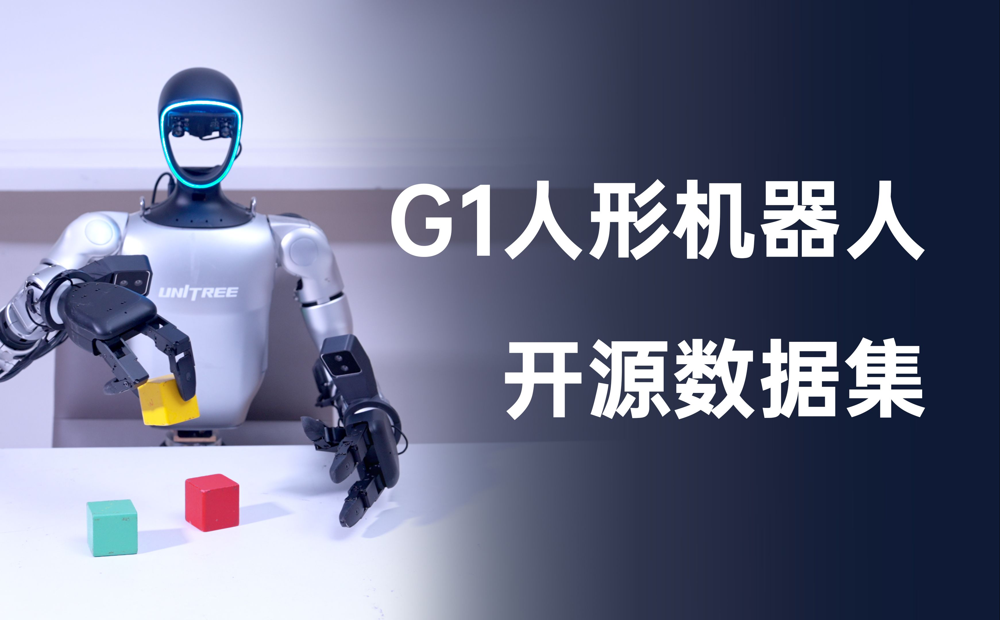
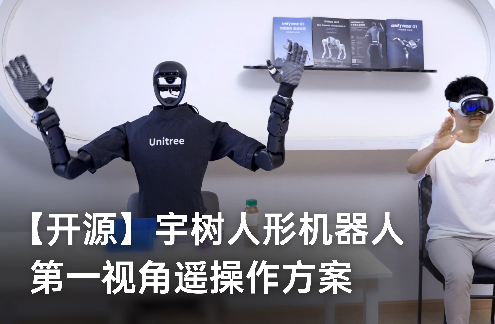

<div align="center">
  <h1 align="center"> avp_teleoperate </h1>
  <h3 align="center"> Unitree Robotics </h3>
  <p align="center">
    <a href="README.md"> English </a> | <a>中文</a> | <a href="README_ja-JP.md">日本語</a>
  </p>
</div>

# 📺 视频演示

<p align="center">
  <table>
    <tr>
      <td align="center" width="50%">
        <a href="https://www.bilibili.com/video/BV124m8YXExJ" target="_blank">
          
        </a>
        <p><b> G1 (29自由度) + Dex3-1</b></p>
      </td>
      <td align="center" width="50%">
        <a href="https://www.bilibili.com/video/BV1SW421X7kA" target="_blank">
          
        </a>
        <p><b> H1_2 (手臂7自由度) </b></p>
      </td>
    </tr>
  </table>
</p>


# 0. 📖 介绍

该仓库实现了使用 **XR设备**（比如 Apple Vision Pro、PICO 4 Ultra Enterprise 或 Meta Quest 3） 对 **宇树（Unitree）人形机器人** 的遥操作控制。

以下是本仓库目前支持的机器人类型：

<table>
  <tr>
    <th style="text-align: center;"> &#129302; 机器人 </th>
    <th style="text-align: center;"> &#9898; 状态 </th>
  </tr>
  <tr>
    <td style="text-align: center;"> <a href="https://www.unitree.com/cn/g1" target="_blank"> G1 (29自由度) </td>
    <td style="text-align: center;"> &#9989; 完成 </td>
  </tr>
  <tr>
    <td style="text-align: center;"> <a href="https://www.unitree.com/cn/g1" target="_blank"> G1 (23自由度) </td>
    <td style="text-align: center;"> &#9989; 完成 </td>
  </tr>
  <tr>
    <td style="text-align: center;"> <a href="https://www.unitree.com/cn/h1" target="_blank"> H1 (手臂4自由度) </td>
    <td style="text-align: center;"> &#9989; 完成 </td>
  </tr>
  <tr>
    <td style="text-align: center;"> <a href="https://www.unitree.com/cn/h1" target="_blank"> H1_2 (手臂7自由度) </td>
    <td style="text-align: center;"> &#9989; 完成 </td>
  </tr>
  <tr>
    <td style="text-align: center;"> <a href="https://www.unitree.com/cn/Dex3-1" target="_blank"> Dex3-1 灵巧手 </td>
    <td style="text-align: center;"> &#9989; 完成 </td>
  </tr>
  <tr>
    <td style="text-align: center;"> <a href="https://support.unitree.com/home/zh/G1_developer/inspire_dfx_dexterous_hand" target="_blank"> 因时灵巧手 </td>
    <td style="text-align: center;"> &#9989; 完成 </td>
  </tr>
  <tr>
    <td style="text-align: center;"> ... </td>
    <td style="text-align: center;"> ... </td>
  </tr>
</table>


以下是需要的设备和接线示意图：

<p align="center">
  <a href="https://oss-global-cdn.unitree.com/static/849e601aedca41e39014ec0f75a86c1e_2950x1445.png">
    
  </a>
</p>

以下是网络拓扑图，以G1机器人为例：

<p align="center">
  <a href="https://oss-global-cdn.unitree.com/static/9871e3bac4c54140b0839c68baf48a4a_1872x929.png">
    
  </a>
</p>


# 1. 📦 前置条件

我们在 Ubuntu 20.04 和 Ubuntu 22.04 上测试了我们的代码，其他操作系统可能需要不同的配置。

有关更多信息，您可以参考 [官方文档](https://support.unitree.com/home/zh/Teleoperation) 和 [OpenTeleVision](https://github.com/OpenTeleVision/TeleVision)。

## 1.1 🦾 逆运动学

```bash
unitree@Host:~$ conda create -n tv python=3.8
unitree@Host:~$ conda activate tv
# 如果您使用 `pip install`，请确保 pinocchio 版本为 3.1.0
(tv) unitree@Host:~$ conda install pinocchio -c conda-forge
(tv) unitree@Host:~$ pip install meshcat
(tv) unitree@Host:~$ pip install casadi
```

> 提醒：命令前面的所有标识符是为了提示：该命令应该在哪个设备和目录下执行。
>
> p.s. 在 Ubuntu 系统 `~/.bashrc` 文件中，默认配置: `PS1='${debian_chroot:+($debian_chroot)}\u@\h:\w\$ '`
> - 以`(tv) unitree@Host:~$ pip install meshcat` 命令为例：
>
>- `(tv)` 表示 shell 此时位于 conda 创建的 tv 环境中；
> 
>- `unitree@Host:~` 表示用户标识 unitree 在设备 Host 上登录，当前的工作目录为 `$HOME`；
> 
>- $ 表示当前 shell 为 Bash；
> 
>- pip install meshcat 是用户标识 unitree 要在 设备 Host 上执行的命令。
> 
>您可以参考 [Harley Hahn's Guide to Unix and Linux](https://www.harley.com/unix-book/book/chapters/04.html#H) 和 [Conda User Guide](https://docs.conda.io/projects/conda/en/latest/user-guide/getting-started.html) 来深入了解这些知识。

## 1.2 🕹️ unitree_sdk2_python

```bash
# 安装 unitree_sdk2_python 库
(tv) unitree@Host:~$ git clone https://github.com/unitreerobotics/unitree_sdk2_python.git
(tv) unitree@Host:~$ cd unitree_sdk2_python
(tv) unitree@Host:~$ pip install -e .
```

> 提醒：原 h1_2 分支中的 [unitree_dds_wrapper](https://github.com/unitreerobotics/unitree_dds_wrapper) 为临时版本，现已全面转换到上述正式的 Python 版控制通信库：[unitree_sdk2_python](https://github.com/unitreerobotics/unitree_sdk2_python)


# 2. ⚙️ 配置

## 2.1 📥 基础

```bash
(tv) unitree@Host:~$ cd ~
(tv) unitree@Host:~$ git clone https://github.com/unitreerobotics/avp_teleoperate.git 
(tv) unitree@Host:~$ cd ~/avp_teleoperate
(tv) unitree@Host:~$ pip install -r requirements.txt
```

## 2.2 🔌 本地流媒体

**Apple Vision Pro** 

苹果不允许在非 HTTPS 连接上使用 WebXR。要在本地测试应用程序，我们需要创建一个自签名证书并在客户端上安装它。您需要一台 Ubuntu 机器和一个路由器。将 Apple Vision Pro 和 Ubuntu **主机**连接到同一个路由器。

1. 安装 mkcert：https://github.com/FiloSottile/mkcert
2. 检查**主机**本地 IP 地址：

```bash
(tv) unitree@Host:~/avp_teleoperate$ ifconfig | grep inet
```

假设 **主机** 的本地 IP 地址为 `192.168.123.2`

> 提醒：您可以使用 `ifconfig` 命令检查您的 **主机** IP 地址。

3. 创建证书：

```bash
(tv) unitree@Host:~/avp_teleoperate$ mkcert -install && mkcert -cert-file cert.pem -key-file key.pem 192.168.123.2 localhost 127.0.0.1
```

将生成的 `cert.pem` 和 `key.pem` 文件放在 `teleop` 目录中

```bash
(tv) unitree@Host:~/avp_teleoperate$ cp cert.pem key.pem ~/avp_teleoperate/teleop/
```

4. 在服务器上打开防火墙：

```bash
(tv) unitree@Host:~/avp_teleoperate$ sudo ufw allow 8012
```

5. 在 Apple Vision Pro 上安装 CA 证书：

```bash
(tv) unitree@Host:~/avp_teleoperate$ mkcert -CAROOT
```

通过 AirDrop 将 `rootCA.pem` 复制到 Apple Vision Pro 并安装它。

设置 > 通用 > 关于本机 > 证书信任设置。在“启用对根证书的完全信任”下，打开对证书的信任。

设置 > 应用 > Safari > 高级 > 功能标志 > 启用 WebXR 相关功能。

> 提醒：在新版本 Vision OS 2 系统中，该步骤有所不同：将证书通过 AirDrop 复制到 Apple Vision Pro 设备后，将会在设置 APP 中左上角账户栏的下方出现证书相关信息栏，点击进去即可启用对该证书的信任。

------

**2.2.2 PICO 4 Ultra Enterprise or Meta Quest 3**

我们已经尝试在 PICO 4 Ultra Enterprise 和 Meta-Quest 3 上使用手部追踪进行遥操作。

PICO 4 Ultra Enterprise 的系统规格如下：

> 系统版本：5.12.6.U；Android 版本号：14；软件版本号：c000_cf01_bv1.0.1_sv5.12.6_202412121344_sparrow_b4244_user
>
> 浏览器版本：[4.0.28 beta version](https://github.com/vuer-ai/vuer/issues/45#issuecomment-2674918619)

Meta-Quest 3 的系统规格如下：

> 系统版本：49829370066100510；版本：62.0.0.273.343.570372087；运行时版本：62.0.0.269.341.570372063；操作系统版本：SQ3A.220605.009.A1

更多配置步骤信息，您可以查看该 [issue](https://github.com/unitreerobotics/avp_teleoperate/issues/32)。

## 2.3 🔎 单元测试

此步骤用于验证环境是否正确安装。

即将展现。


# 3. 🚀 使用方法

在开始此程序之前，请至少阅读一次 [官方文档](https://support.unitree.com/home/zh/Teleoperation)。

## 3.1 🖼️ 图像服务器

将 `avp_teleoperate/teleop/image_server` 目录中的 `image_server.py` 复制到宇树机器人（G1/H1/H1_2 等）的 **开发计算单元 PC2**，并在 **PC2** 上执行以下命令：

```bash
# 提醒1：可以通过scp命令将image_server.py传输到PC2，然后使用ssh远程登录PC2后执行它。
# 假设开发计算单元PC2的ip地址为192.168.123.164，那么传输过程示例如下：
# 先ssh登录PC2，创建图像服务器的文件夹
(tv) unitree@Host:~$ ssh unitree@192.168.123.164 "mkdir -p ~/image_server"
# 将本地的image_server.py拷贝至PC2的~/image_server目录下
(tv) unitree@Host:~$ scp ~/avp_teleoperate/teleop/image_server/image_server.py unitree@192.168.123.164:~/image_server/

# 提醒2：目前该图像传输程序支持OpenCV和Realsense SDK两种读取图像的方式，请阅读image_server.py的ImageServer类的注释以便您根据自己的相机硬件来配置自己的图像传输服务。
# 现在位于宇树机器人 PC2 终端
unitree@PC2:~/image_server$ python image_server.py
# 您可以看到终端输出如下：
# {'fps': 30, 'head_camera_type': 'opencv', 'head_camera_image_shape': [480, 1280], 'head_camera_id_numbers': [0]}
# [Image Server] Head camera 0 resolution: 480.0 x 1280.0
# [Image Server] Image server has started, waiting for client connections...
```

在图像服务启动后，您可以在 **主机** 终端上使用 `image_client.py` 测试通信是否成功：

```bash
(tv) unitree@Host:~/avp_teleoperate/teleop/image_server$ python image_client.py
```

## 3.2 ✋ Inspire 手部服务器（可选）

> 注意：如果选择的机器人配置中没有使用一代 Inspire 灵巧手，那么请忽略本节内容。

您可以参考 [灵巧手开发](https://support.unitree.com/home/zh/H1_developer/Dexterous_hand) 配置相关环境并编译控制程序。首先，使用 [此链接](https://oss-global-cdn.unitree.com/static/0a8335f7498548d28412c31ea047d4be.zip) 下载灵巧手控制接口程序，然后将其复制到宇树机器人的**PC2**。

在宇树机器人的 **PC2** 上，执行命令：

```bash
unitree@PC2:~$ sudo apt install libboost-all-dev libspdlog-dev
# 构建项目
unitree@PC2:~$ cd h1_inspire_service & mkdir build & cd build
unitree@PC2:~/h1_inspire_service/build$ cmake .. -DCMAKE_BUILD_TYPE=Release
unitree@PC2:~/h1_inspire_service/build$ make
# 终端 1. 运行 h1 inspire 手部服务
unitree@PC2:~/h1_inspire_service/build$ sudo ./inspire_hand -s /dev/ttyUSB0
# 终端 2. 运行示例
unitree@PC2:~/h1_inspire_service/build$ ./h1_hand_example
```

如果两只手连续打开和关闭，则表示成功。一旦成功，即可关闭终端 2 中的 `./h1_hand_example` 程序。

## 3.3 🚀 启动

>  
>
>  1. 所有人员必须与机器人保持安全距离，以防止任何潜在的危险！
>  2. 在运行此程序之前，请确保至少阅读一次 [官方文档](https://support.unitree.com/home/zh/Teleoperation)。
>  3. 请务必确保机器人已经进入[调试模式（L2+R2）](https://support.unitree.com/home/zh/H1_developer/Remote_control)，以停止运动控制程序发送指令，这样可以避免潜在的指令冲突问题。

最好有两名操作员来运行此程序，称为 **操作员 A** 和 **操作员 B**。


首先，**操作员 B** 需要执行以下步骤：

1. 修改  `~/avp_teleoperate/teleop/teleop_hand_and_arm.py` 中 `if __name__ == '__main__':` 代码下方的 `img_config` 图像客户端配置，它应该与 3.1 节中您在 PC2 配置的图像服务器参数相同。

2. 根据您的机器人配置选择不同的启动参数。以下是一些启动命令示例：

   ```bash
   # 1. G1(29DoF)机器人 + Dex3-1 灵巧手 （实际上，G1_29是--arm的默认参数，可以选择不填写）
   (tv) unitree@Host:~/avp_teleoperate/teleop$ python teleop_hand_and_arm.py --arm=G1_29 --hand=dex3
   
   # 2. 仅G1(29DoF)机器人
   (tv) unitree@Host:~/avp_teleoperate/teleop$ python teleop_hand_and_arm.py

   # 3. G1 (23DoF) 机器人
   (tv) unitree@Host:~/avp_teleoperate/teleop$ python teleop_hand_and_arm.py --arm=G1_23
   
   # 4. H1_2 机器人 + 一代 Inspire 灵巧手
   (tv) unitree@Host:~/avp_teleoperate/teleop$ python teleop_hand_and_arm.py --arm=H1_2 --hand=inspire1

   # 5. H1 机器人
   (tv) unitree@Host:~/avp_teleoperate/teleop$ python teleop_hand_and_arm.py --arm=H1
   
   # 6. 如果您想开启数据可视化+录制，还可以追加 --record 选项
   (tv) unitree@Host:~/avp_teleoperate/teleop$ python teleop_hand_and_arm.py --arm=G1_23 --record
   ```

3. 程序如果正常启动，终端最后一行将停留在 “Please enter the start signal (enter 'r' to start the subsequent program):” 的字符串输出。


然后，**操作员 A** 需要执行以下步骤：

1. 戴上您的 Apple Vision Pro 设备。

2. 在 Apple Vision Pro 上打开 Safari，访问：https://192.168.123.2:8012?ws=wss://192.168.123.2:8012

   > 注意：此 IP 地址应与您的 **主机** IP 地址匹配。

3. 点击 `Enter VR` 并选择 `Allow` 以启动 VR 会话。

4. 您将会在Apple Vision Pro中看到机器人的第一人称视野。


接下来，**操作员 B** 可以在终端中按下 **r** 键以启动远程操作程序。

此时，**操作员 A** 可以远程控制机器人的手臂（和灵巧手）。

如果使用了`--record`参数，那么**操作员 B** 可以在打开的“record image”窗口中按 **s** 键开始录制数据，再次按 **s** 键停止。可以根据需要重复此操作进行多次录制。

> 注意1：录制的数据默认存储在 `avp_teleoperate/teleop/utils/data` 中，使用说明见此仓库： [unitree_IL_lerobot](https://github.com/unitreerobotics/unitree_IL_lerobot/blob/main/README_zh.md#%E6%95%B0%E6%8D%AE%E9%87%87%E9%9B%86%E4%B8%8E%E8%BD%AC%E6%8D%A2)。
>
> 注意2：请在录制数据时注意您的硬盘空间大小。

## 3.4 🔚 退出

>  
>
> 为了避免损坏机器人，最好确保**操作员 A** 将机器人手臂摆放为自然下垂或其他恰当位置后，**操作员B **再按 **q** 退出。

要退出程序，**操作员 B** 可以在 'record image' 窗口中按下 **q** 键。


# 4. 🗺️ 代码库教程

```
avp_teleoperate/
│
├── assets                    [存储机器人 URDF 相关文件]
│
├── teleop
│   ├── image_server
│   │     ├── image_client.py      [用于从机器人图像服务器接收图像数据]
│   │     ├── image_server.py      [从摄像头捕获图像并通过网络发送（在机器人板载计算单元上运行）]
│   │
│   ├── open_television
│   │      ├── television.py       [使用 Vuer 从 Apple Vision Pro 捕获腕部和手部数据]  
│   │      ├── tv_wrapper.py       [对捕获的数据进行后处理]
│   │
│   ├── robot_control
│   │      ├── robot_arm_ik.py     [手臂的逆运动学]  
│   │      ├── robot_arm.py        [控制双臂关节并锁定其他部分]
│   │      ├── robot_hand_inspire.py  [控制因时灵巧手]
│   │      ├── robot_hand_unitree.py  [控制宇树灵巧手]
│   │
│   ├── utils
│   │      ├── episode_writer.py          [用于记录模仿学习的数据]  
│   │      ├── mat_tool.py                [一些小的数学工具]
│   │      ├── weighted_moving_filter.py  [用于过滤关节数据的滤波器]
│   │      ├── rerun_visualizer.py        [用于可视化录制数据]
│   │
│   │──teleop_hand_and_arm.py    [遥操作的启动执行代码]
```


# 5. 🛠️ 硬件

## 5.1 📋 清单

|           项目            | 数量 |                             链接                             |              备注              |
| :-----------------------: | :--: | :----------------------------------------------------------: | :----------------------------: |
| **宇树通用人形机器人 G1** |  1   |                https://www.unitree.com/cn/g1                 |     需选配开发计算单元版本     |
|   **Apple Vision Pro**    |  1   |          https://www.apple.com.cn/apple-vision-pro/          |                                |
|        **路由器**         |  1   |                                                              |                                |
|       **用户电脑**        |  1   |                                                              |  推荐显卡性能在RTX 4080 以上   |
|     **头部双目相机**      |  1   |  [仅供参考] http://e.tb.cn/h.TaZxgkpfWkNCakg?tk=KKz03Kyu04u  | 用于机器人头部视野，视场角130° |
|     **头部相机支架**      |  1   | https://github.com/unitreerobotics/avp_teleoperate/blob/g1/hardware/head_stereo_camera_mount.STEP |        用于装配头部相机        |
| 英特尔 RealSense D405相机 |  2   |      https://www.intelrealsense.com/depth-camera-d405/       |      用于腕部灵巧操作视野      |
|     腕部相机环形支架      |  2   | https://github.com/unitreerobotics/avp_teleoperate/blob/g1/hardware/wrist_ring_mount.STEP |     与腕部相机支架搭配使用     |
|       左腕相机支架        |  1   | https://github.com/unitreerobotics/avp_teleoperate/blob/g1/hardware/left_wrist_D405_camera_mount.STEP |      用于装配左腕D405相机      |
|       右腕相机支架        |  1   | https://github.com/unitreerobotics/avp_teleoperate/blob/g1/hardware/right_wrist_D405_camera_mount.STEP |      用于装配右腕D405相机      |
|       M3-1 六角螺母       |  4   |              [仅供参考] https://a.co/d/gQaLtHD               |         用于腕部紧固件         |
|        M3x12 螺钉         |  4   |            [仅供参考] https://amzn.asia/d/aU9NHSf            |         用于腕部紧固件         |
|         M3x6 螺钉         |  4   |            [仅供参考] https://amzn.asia/d/0nEz5dJ            |         用于腕部紧固件         |
|      **M4x14 螺钉**       |  2   |            [仅供参考] https://amzn.asia/d/cfta55x            |         用于头部紧固件         |
|     **M2x4 自攻螺钉**     |  4   |            [仅供参考] https://amzn.asia/d/1msRa5B            |         用于头部紧固件         |

> 注意：加粗项目是进行遥操作任务时的必需设备，其余项目是录制[数据集](https://huggingface.co/unitreerobotics)时的可选设备。

## 5.2 🔨 安装示意图

<table>
    <tr>
        <th align="center">项目</th>
        <th align="center" colspan="2">仿真</th>
        <th align="center" colspan="2">实物</th>
    </tr>
    <tr>
        <td align="center">头部</td>
        <td align="center">
            <p align="center">
                
                <figcaption>头部支架</figcaption>
            </p>
        </td>
        <td align="center">
            <p align="center">
                
                <figcaption>装配侧视</figcaption>
            </p>
        </td>
        <td align="center" colspan="2">
            <p align="center">
                
                <figcaption>装配正视</figcaption>
            </p>
        </td>
    </tr>
    <tr>
        <td align="center">腕部</td>
        <td align="center" colspan="2">
            <p align="center">
                
                <figcaption>腕圈及相机支架</figcaption>
            </p>
        </td>
        <td align="center">
            <p align="center">
                
                <figcaption>装配左手</figcaption>
            </p>
        </td>
        <td align="center">
            <p align="center">
                
                <figcaption>装配右手</figcaption>
            </p>
        </td>
    </tr>
</table>


> 注意：如图中红圈所示，腕圈支架与机器人手腕接缝对齐。


# 6. 🙏 鸣谢

该代码基于以下开源代码库构建。请访问以下链接查看各自的许可证：

1. https://github.com/OpenTeleVision/TeleVision
2. https://github.com/dexsuite/dex-retargeting
3. https://github.com/vuer-ai/vuer
4. https://github.com/stack-of-tasks/pinocchio
5. https://github.com/casadi/casadi
6. https://github.com/meshcat-dev/meshcat-python
7. https://github.com/zeromq/pyzmq
8. https://github.com/unitreerobotics/unitree_dds_wrapper
9. https://github.com/tonyzhaozh/act
10. https://github.com/facebookresearch/detr
11. https://github.com/Dingry/BunnyVisionPro
12. https://github.com/unitreerobotics/unitree_sdk2_python
